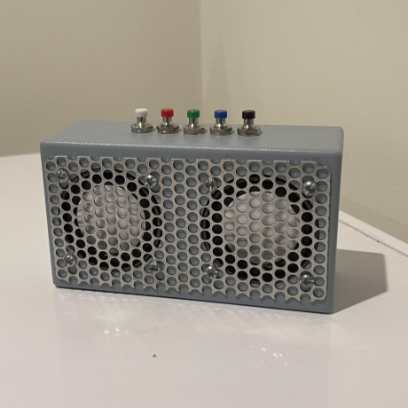
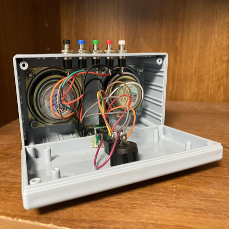

## Overview

The speaker was built while I was attending a summer engineering program at Honolulu Community College while I was contemplating my intended major. The objective of this program was to expose students to some of the concepts and different fields of engeering. At the same time, the organizers wanted to enhance the experience by building interesting gadgets. 

## Some of the Things Done

Some of the projects done in the program were related to either the application of engineering, or building gadgets using current engineering methods. In regards to the application of engineering, one of the tasks weas to build a functional bridge with planks of woods that could wistand the weight of a person. However the catch was that the use of bolts, glue, or nails was prohibited. Another project that comes to mind is designing a product that would expose children to engineering in a fun way. In regards to building the gadgets, we designed an ukelele with a 3D printing software, built a speaker, tinkered with arduino boards and other creative electrical projects. 

## The Experience

From this project, I was able to learn and experience a simplified version of making a game. A lot of communication skills were developed while brainstorming ideas and managing the progress. It also was very enlightening about teamwork as this was my first project not individually done. On top of that, I learned the fundamental concepts about sprites and the process to move them. Finally, it was a good project to assess my fundamental knowledge about C++.  

