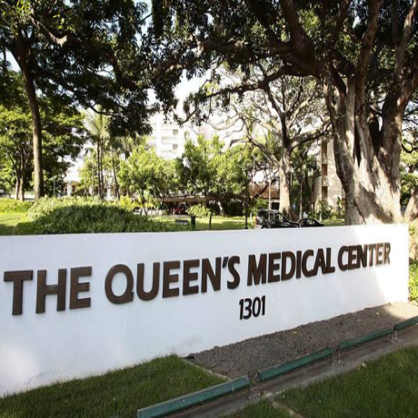

## Overview

## Role

As a volunteer of the Queen's Medical Center Radiology Department, my role was to ensure that patient records were properly sorted and updated. The supervisor on my first day explained my tasks, then I was left to my own work. My workspace was one of the many little cubicle in the section. As a result, this was a self-directed environment where you must keep yourself working. If you finished the work, it was your responsibility to find another tasks rather than receive work from the supervisor.  

## The Experience

I found this experience to be very valuable, especially in regard to communication. Since I was left to be independent, I needed to figure out how to ask questions efficiently and effectively to avoid delaying my supervisor's work. In addition, I was able to develop a good foundational mindset due to the independence and the nature of the task. Since the documents I was working with were patient's records, I had to effectively seperate my work from my personal life.
